# Using Computer Vision and Machine Learning on a Raspberry PI based GoPiGo car to follow a line.

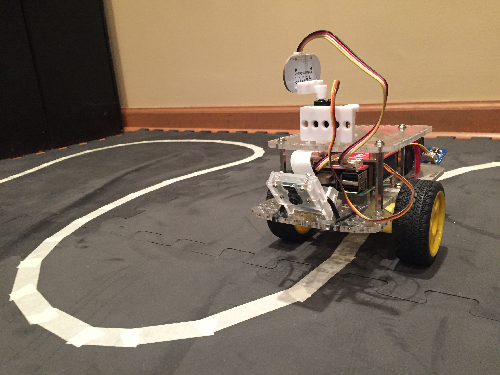

The Camera View while driving with the dots showing the predictions.

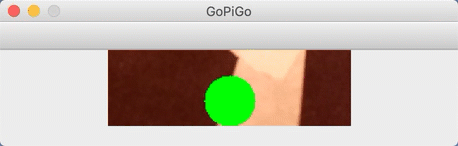
----
I have a [YouTube Video](https://youtu.be/ZOMmYHWG4CU) showing some of the training run on the training course.

I have a a Testing [YouTube Video](https://www.youtube.com/watch?v=GgmnzQduv5E) of the final testing on a new track layout.

---


I have given presentations on machine learning, where one of the interactive examples that I use is to train a simulated car driving on a simulated road.  

I thought, could I use what I know about machine learning and a GoPiGo to build an actual device that followed a line.

I realize DexterIndustries has a ['line follower' sensor](https://www.dexterindustries.com/GoPiGo/gopigo-line-follower-getting-started/using-gopigo-line-follower/) but the goal was to use computer vision techniques to acquire and process the raw image data, into a form that a machine learning model can learn from.

While this project is simple in concept, I found it to be a very good intermediate level, end-to-end, machine learning project.

The article represents my approach to solving that problem. 

## Audience

Who is the audience for this article? 

My target audience for this article are educators that are looking for a fun way to introduce the concepts of computer vision and machine learning to students and those people that like to work with a RaspberryPI from a hobbyist perspective.

This is not a hard hitting body of work on the latest advances in computer vision and machine learning.  But if you are looking for a fun and accessible application of the technology then I think you will enjoy this article.

## References

### ImageZMQ
To send images from the GoPiGo/RaspberryPI and a laptop I used a package written by Jeff Bass called, ImageZMQ.
You can find out more about ImageZMQ on his Github repo [here](https://github.com/jeffbass/imagezmq).

I am using my fork of his repo with a couple of mods so if you build this project, be sure to get [my fork](https://github.com/youngsoul/imagezmq).

### PyImageSearch

Adrian Rosebrock runs [PyImageSearch.com](www.pyimagesearch.com).  IMHO, the best resource for Computer Vision and how to apply Deep Learning to Computer Vision.

I have a number of his [books](https://www.pyimagesearch.com/books-and-courses/), and they are all excellent.

For this project, I was using this series of books, [Raspberry PI for Computer Vision](https://www.pyimagesearch.com/raspberry-pi-for-computer-vision/).  There are 3 books in the series.  If you want to know more about how to apply computer vision to the Rasbperry PI there is no better resource.

In the Hacker Bundle, Adrian also tackles the Line Follower project but takes a more Computer Vision approach, which I decided to take a Machine Learning approach.

You find out more about the RPi4CV series of books [here](https://www.pyimagesearch.com/raspberry-pi-for-computer-vision/).

## Overview

The goal of this project was to 'teach' a GoPiGo Robot car how to follow a line.  There are a number of ways to do this.  This project focused on using Machine Learning and Computer Vision to solve this problem.

This project uses a [GoPiGo3 Robot Car from DexterIndustries](https://www.dexterindustries.com/gopigo3/) with a RaspberryPI3 - not even the latest RaspberryPI4 - with an additional Raspberry PI camera, and a GrovePI button.

The goal was to create a training track with different kinds of turns and line curvatures to collect training images that represent:

* Left Turns

* Right Turns

* Continue Straight 

This is a supervised machine learning project, meaning we will collected labeled training data.

Once we have enough labeled training data, we can start the process of finding the 'best' machine learning model.  In this case, 'best' is not just the one that is the most accurate predictor but also the one that can run fast enough for the GoPiGo to make decisions.  

Lastly, once we have a trained model, create a new testing track to see how the model behaves on a track it has not seen before.

Once the GoPiGo was fully deployed, I also wanted a way to stream the video that the car was 'seeing' back to a laptop to get a sense for how the model was behaving.

### Considerations

* Speed of training

We will see that the ultimate model had to be trained on the RaspberryPI.  While some models and techniques might have produced better accuracy, the trade off of training time had to be considered.

* Speed of making predictions

While the car was driving, the video camera was feeding frames to the computer vision pipeline and model to turn predictions.  This process had to be as fast as possible.  The speed of model inference was a very important characteristic to consider.

* Streaming the video from the GoPiGo to a laptop dashboard

To provide insight into what the GoPiGo was seeing, and the decisions it was making, I wanted to stream the video back to a laptop to be displayed.  This turned out to be very helpful in the 'debugging' phase but also visually engaging after the system was functional.


## Materials
### GoPiGo Robot Car
[GoPiGo](https://www.dexterindustries.com/gopigo3/)

### Floor Mat

I used 9, 1/2 inch black form floor tiles that you can find inexpensively at [Walmart](https://www.walmart.com/ip/Everyday-Essentials-1-2-Thick-Flooring-Puzzle-Exercise-Mat-with-High-Quality-EVA-Foam-Interlocking-Tiles-6-Piece-24-Sq-Ft-Multiple-Colors/336366651?selected=true)

You want to use black, because the contrast between the floor and the line will be very important.

### Line Tape

I used basic masking tape and found it to work well but white electrical tape would also work.  Keep in mind that you will be putting the tape down and taking it up often and you want that to be simple and non-destructive to the floor mats.

### Raspberry PI Camera

You will want the V2 Camera Module.  The [RaspberryPI](https://www.raspberrypi.org/products/camera-module-v2/) org has a page with a number of places to get this camera.

### Grove Button ( Optional )

[Grove Button](https://shop.dexterindustries.com/shop/sensors-accessories/sensors-actuators/grove-button)

I used a button to start and stop the GoPiGo car but this is not required.

### Camera Mount

The camera mount is tricky because, as far as I know, there is no commercial camera mount for the GoPiGo3 that attaches to the front of the car at about a 45 degree angle pointing downwards.

I used a camera mount like:

[Amazon Link to Camera Mount](https://www.amazon.com/Makeronics-Acrylic-Holder-Raspberry-Transparent/dp/B07SQL2RNR)

but that tilts the camera up.  The rounded points of the base of mount just fit into a couple of the GoPiGo3 holes.  I then tipped the camera mount forward, put some weather stripping under it, and used a twist tie to fasten it to the GoPiGo3.  I know - its very McGyver.

The angle is about 45 degress from the horizontal.  

Adrian in the RPi4CV Hacker Bundle used some duct tape and cardboard.  

> Left Side
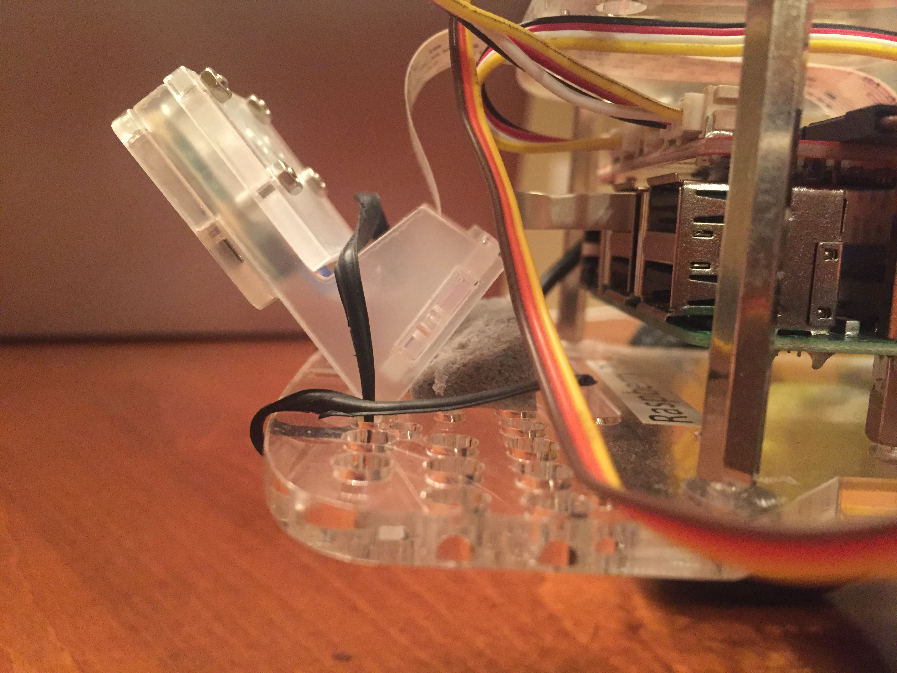

> Right Side
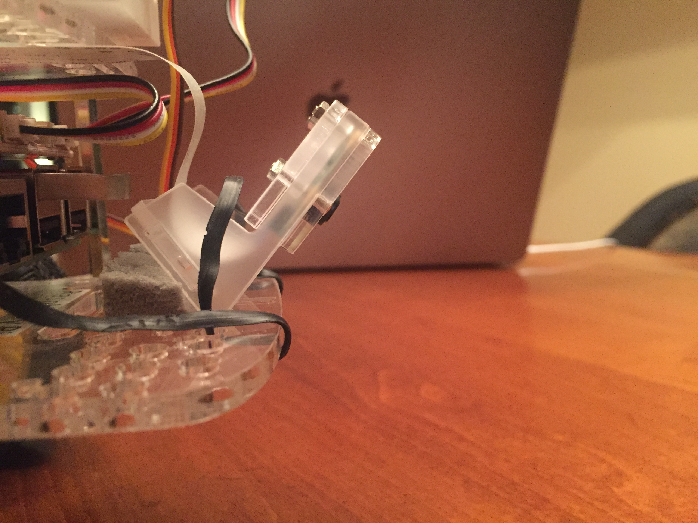

> Top
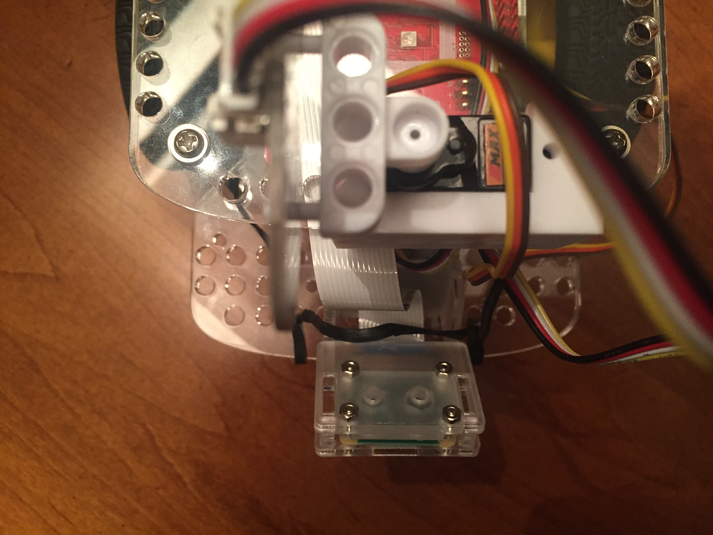

> Bottom


## Car Setup

## RaspberryPI Image
Getting a properly configured RaspberryPI image can be challenging.

I started with the Desktop Buster version of [Raspbian](https://www.raspberrypi.org/downloads/raspbian/).

First let me say I **DO NOT** recommend the GoPiGo DexterOS.  It is too limiting and for this project you will want full control to install software.

You will need to include OpenCV on the RaspberryPI. Here are some links and suggestions to get started:

### My Blog Post

I created a [Medium](https://medium.com/@patrick_ryan/building-opencv-4-10-on-raspian-buster-and-raspberry-pi4-64669bd2eb74) blog post on installing OpenCV4 on a RaspberryPI.  It is time consuming but if you follow the steps it is not hard.

### PyImageSearch.com

[PyImageSearch](https://www.pyimagesearch.com/2019/09/16/install-opencv-4-on-raspberry-pi-4-and-raspbian-buster/) has a blog post on how to install OpenCV4 on a RPI4, but it should work the same with a RPI3.

### PyImageSearch RaspberryPI for Computer Vision

[RaspberryPI for Computer Vision](https://www.pyimagesearch.com/raspberry-pi-for-computer-vision/)

This is a 3 book set, and you can buy 1,2 or all 3 books.  With any book purchase Adrian provides a Raspian Image with the libraries already setup and installed.  This is by far the easiest way to get started, and you get an amazing set of books on how to use the Rasbperry PI for computer vision.

This is the approach I took.


## Development Environment

For this project I used [PyCharm Professional](https://www.jetbrains.com/pycharm/).  I wanted to use the remote Python interpreter and remote deployment capabilities.  This allowed me to development on my MacBookPro but use the interpreter on the GoPiGo and when I saved files they were automatically synched to the GoPiGo.  Executing scripts on my MacBookPro actually executed the script on the GoPiGo.

Using PyCharm is NOT a requirement.  As long as the files make it down to the GoPiGo eventually any preferred method will work.
 

## Collecting Training Data

### Preparing Video Images

Before getting into collecting the training images, we first need to apply some computer vision to the images from the camera attached to the front of the car.

The raw image from the front of the car looks like:

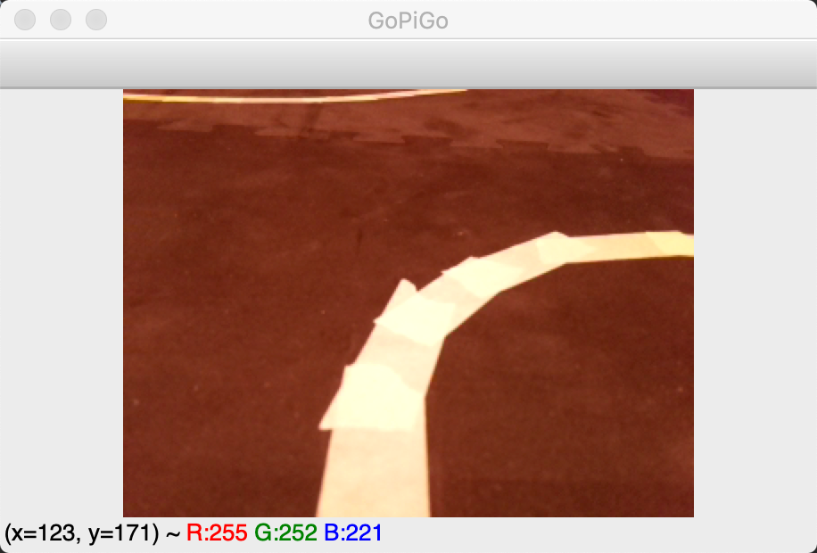

We need to reduce this image to just that portion that is in front of the car.  To do this we create a region of interest (ROI) that represents the bottom 25% of the image and a 60% of the width.  The following code snippet is what creates this smaller image:

```python
    (H, W, C) = image.shape
    startY = int(H * 0.75)
    endY = H
    startX = int(W * 0.2)
    endX = int(W * 0.8)
    roi = image[startY:endY, startX:endX]
```

This created a ROI of shape, (60, 192, 3).

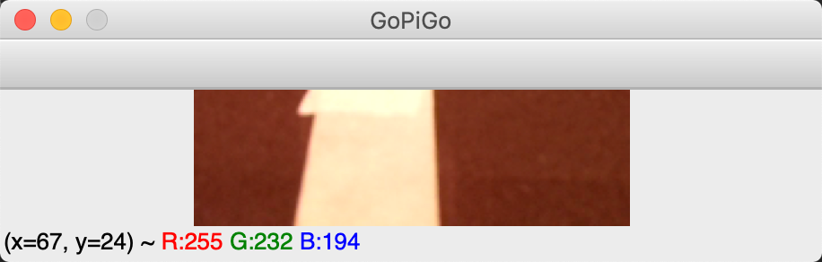

roi will be slice of the original image.  For our machine learning algorithm we would like the image to be a black and white image.  To do that we convert the image to greyscale, and then threshold the image to make the picture black and white
Use cv2 to convert the color and call threshold.  Notice that I used `THRESH_BINARY_INV` because I wanted a white background with a black line.  I believe this would work with a black background and white line as well.
```python
    gray_image = cv2.cvtColor(roi, cv2.COLOR_BGR2GRAY)
    (T, thresh) = cv2.threshold(gray_image, 0, 255, cv2.THRESH_BINARY_INV | cv2.THRESH_OTSU)
```

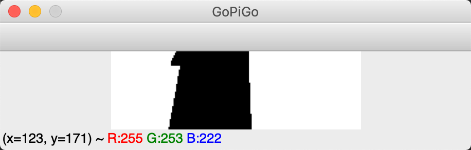

Now we have the images from the camera collecting just the front of the GoPiGo, and converted to black and white.

### Collecting Training Images by Driving

To collect training images I setup a training track with different turns and curves.    

Even though I setup 90 degree turns, for this project I decided to not handle 90 degree turns but only those with some curvature to them.

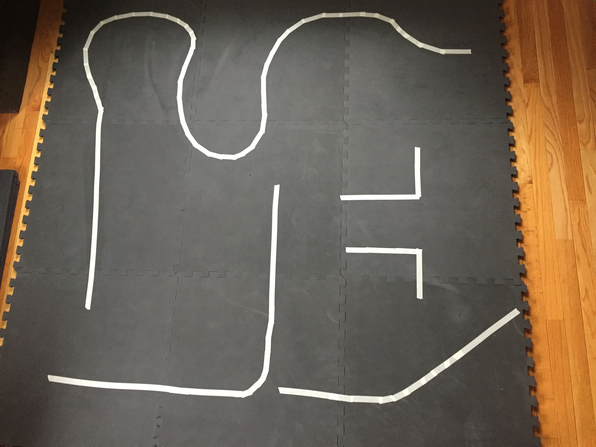

I then created a GoPiGo training script to sending processed images to the training server application.  The training server application would allow me to assign a training label of 'left', 'straight', 'right' to the image and it would save the image to the appropriately named folder.  If I selected the incorrect label, 'd' will delete the last image saved.

#### GoPiGo Training Scripts

The `gpg_training_data_collector.py` script sends processed images to the `server_training_data_collector.py` running on my MacBookPro.

This allows me to view the image and decide if that image should represent 'left', 'straight', 'right'. Once selected, the image is saved on the laptop and a command sent to the GoPiGo to perform the command and move forward a short distance.  This repeated for all of the training lines.

See the folder:  `training_data/left`, `training_data/right`, `training_data/straight` for a collection of the files.

##### Left Training Images

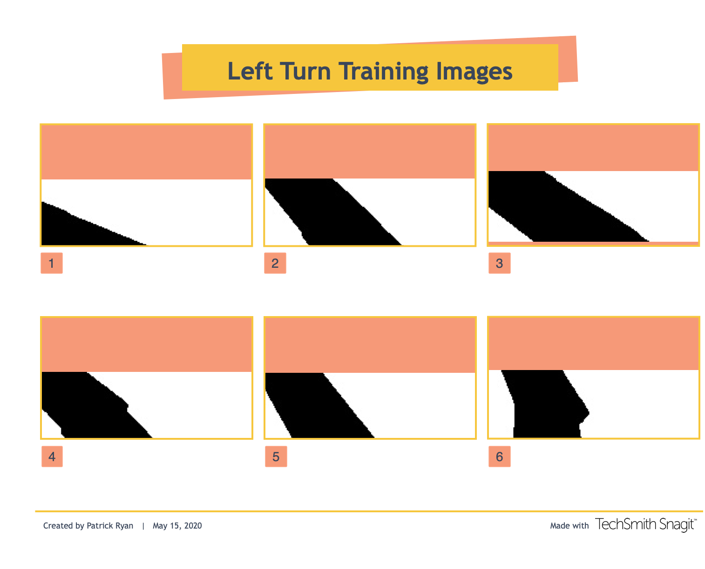

##### Straight Training Images

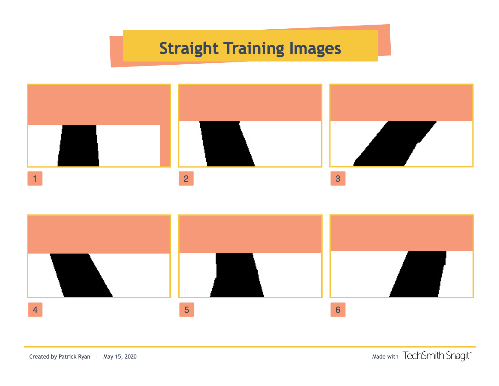

##### Right Training Images

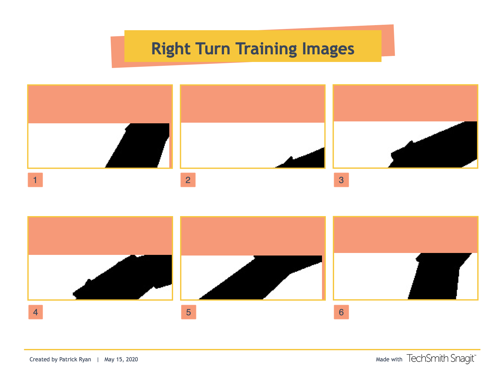

In determining what label to apply to each image, it took a combination of looking at the image from the GoPiGo and seeing where the GoPiGo was on the track.  What looked like a turn, actually made more sense to go straight for a little while longer before turning.

I am still not sure all of the images are labeled 'correctly' but the GoPiGo is able to follow the lines.

### ImageZMQ

To send images from the GoPiGo and receive responses from the MacBookPro, I used an open source package called ImageZMQ.  This package was created by Jeff Bass and you can find his Github repo [here](https://github.com/jeffbass/imagezmq).

I am using [my fork](https://github.com/youngsoul/imagezmq) because I added the ability to have send/receive timeouts incase either the client or the server dropped.

The ImageZMQ library uses [Zmq](https://zeromq.org) to send images and has a class to send images called, `ImageSender` and a class to receive messages called, `ImageHub`.  This makes it very easy to send images and the request/response protocol is handled as is the data formatting.

The messaging to collect the images looks as follows:

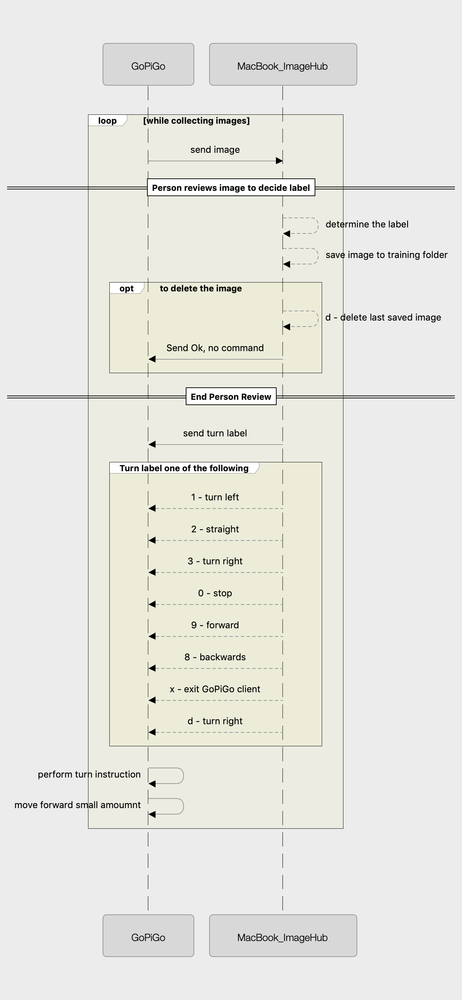 

### Training Image GoPiGo Client
See:

> `gpg_training_data_collector.py`

This file contains the client that runs on the GoPiGo.  Essentially this is an infinite loop collecting frames from the video camera, sending the image and getting the response from the server as to what to do next.

### Training Image Server 
See:
> `server_training_data_collector.py`

This file contains the server that runs on a laptop.  Essentially this is an infinite loop receiving an image.  I determine what label to associate to the image. Finally the server responds with a command telling the GoPiGo what to do.

In total the following number of images were collected:
```text
.
├── left [403 entries exceeds filelimit, not opening dir]
├── right [320 entries exceeds filelimit, not opening dir]
└── straight [422 entries exceeds filelimit, not opening dir]

```
## Training a model

Once we have the training images we can then train the model.

There are a couple of things to keep in mind here:
> I am running code on the GoPiGo for development, but during the model exploration phase I want to run on my MacBookPro.  I created a separate project for training and tuning the model.

> Ultimately, I have to train the final model on the GoPiGo because you cannot create a model in one compute architecture and save to another.  It wont work - I tried

> The model you ultimately select will be calculating inferences on the GoPiGo so it has to be fast

I ultimately decided to create a new Python project that was just for model exploration.

You can find that Github repo [here](https://github.com/youngsoul/gpg-linefollow-model.git)

The file in the above repo to look at is:  `train_eval_logreg.py`.  The other files were used for more exploratory model analysis.  I ultimately settle on LogisticRegression because it was very fast to execute in the RaspberryPI.  RandomForest and Knn, with the best parameters ran too slow to allow for the model to predict the turns.

I will summarize the details here.

The function:
```python
def find_best_logreg_model_params(X, y):
    """
    {'solver': 'saga', 'penalty': 'l2', 'C': 0.0001}
    :param X: ndarray of shape ( 60*192 ) = 11520
    :type X: ndarray
    :param y:
    :type y:
    :return:
    :rtype:
    """
    model = LogisticRegression()
    random_grid = {
        'solver': ['lbfgs', 'newton-cg', 'sag', 'saga'],
        'penalty': ["l2"],
        'C': [1e-4, 1e-3, 1e-2, 1e-1],
        'class_weight': [None, 'balanced']
    }
    rf_random = RandomizedSearchCV(estimator=model,
                                   param_distributions=random_grid,
                                   n_iter=75, cv=3,
                                   verbose=2,
                                   random_state=42,
                                   n_jobs=-1)
    rf_random.fit(X, y)
    print(rf_random.best_params_)

```
is used to tune the Hyperparameters of a LogisticRegression model.  This function assumes the images have been read in and are flatten into an array of share (11520,).

After this completes it produces the following:
```text
clf = LogisticRegression(penalty="l2", C=0.0001, solver='saga', multi_class='auto')

Cross Value took: 88.6061041355133 seconds
[0.96943231 0.9650655  0.9650655  0.97816594 0.96069869]
0.9676855895196507
```

Based on the training data, it found hyperparameters that resulted in an accuracy of about 96.7%.

The confusion matrix for the training data is shown below:
```text
actual vs predicted:

          left  straight  right
left       395         8      0
straight    11       403      8
right        0         9    311
```

When I was tuning and evaluating the model, while I definitely was trying to maximize the diagonal values, I wanted to minimize the left,right and right,left prediction mismatches.

Having [left, right]==0 and [right,left]==0 was exactly my goal.  I could live with an incorrect 'straight' prediction on the premise it would correct on the next image, but it was very difficult to recover from incorrectly turning right, when I needed to turn left.

## Deploying a model to the RaspberryPI

Once I knew the LogisticParameters to use, I still had to train the model on the RaspberryPI on the GoPiGo.  Fortuntely training a LogisticRegression model is not too bad on the GoPiGo.

This does imply that I transferred the training_data set to the RaspberryPI and to train the model I used the script called:  `train_model.py` in this repo.

Remove comments, etc the training script is as below:
```python
from sklearn.linear_model import LogisticRegression
from imutils import paths
import cv2
from joblib import dump

# 0, 1, 2
directions = ["left", "straight", "right"]

image_path_root = "/home/pi/dev/training_data"

def get_image_data():
    imagePaths = list(paths.list_images(image_path_root))
    direction_vector = []
    images_vector = []
    for imagePath in imagePaths:
        image = cv2.imread(imagePath)
        image = cv2.cvtColor(image, cv2.COLOR_BGR2GRAY)

        flatten_image = image.flatten()
        direction = directions.index(imagePath.split("/")[-2])
        images_vector.append(flatten_image)
        direction_vector.append(direction)

    return images_vector, direction_vector


def get_model():
    clf = LogisticRegression(penalty="l2", C=0.0001, solver='saga', multi_class='auto')
    return clf

def train_save_model(model, X, y):
    model.fit(X, y)
    dump(model, "rpi_gpg3_line_follower_model.sav")

if __name__ == '__main__':
    model = get_model()
    X, y = get_image_data()
    train_save_model(model, X, y)
```

You get the model with parameters based on the previous model exploration, load the image data and train the model.  When the model is complete, save the model locally to the RaspberryPI.

At this point you are ready to create a script to use the model, with new images from the video feed to predict the direction to go.

### Training YouTube Video

I have a [YouTube Video](https://youtu.be/ZOMmYHWG4CU) showing some of the training run on the training course.

## Drive By Model

The script that executes to use the ML model and follow the line is, `drive_by_model.py`.

At present, the script assume you are remotely logged into the RaspberryPI on the GoPiGo to start the script. 

The script looks for a button press to start/stop following the line.  

Essentially the script performs the following:
```text
FOREVER:
    read a frame from the video camera

    process the image to resize and threshold

    flatten image

    predict left, straight, right from image
    
    send image to server

    adjust motor speeds 

```

I tried a few different models but LogisticRegression was the only one that I tried that was able to make a prediction fast enough.  The prediction time was around 2 ms.

### Turning Rate and Speed

Two parameters that will impact performance are the speed of the vehicle and the turning rate.

The faster the GoPiGo is set to the more aggresive you will have to make the turns, meaning how you shift the power between the two wheels.


### Testing YouTube Video

[YouTube Video](https://www.youtube.com/watch?v=GgmnzQduv5E) of the final testing on a new track layout.

TODO

### Starting the program at startup

## Testing the Line Follower

## Things I learned

### Start/Stop turning versus continuous turning


## ZMQ

`pip install pyzmq`

## Run Image Server

`source ~/.virtualenvs/py36cv4_venv/bin/activate`

`python receive_images.py`

`python server_training_data_collector.py --save-images 1`


## RPI

`source ~/.virtualenvs/gopigo3/bin/activate`

`python ./send_immediate_images.py --server-ip 192.168.1.208`

* You have to train the model on the RPI because you cannot train and save the model on one architecture and load it from another cpu architecture.

* You have to transfer the training images to rpi

* train model and save model

## Train Model

Training the model is handled by a different project

/Users/patrickryan/Development/python/mygithub/gpg3-linefollow-model

This will save a model file that can be loaded
